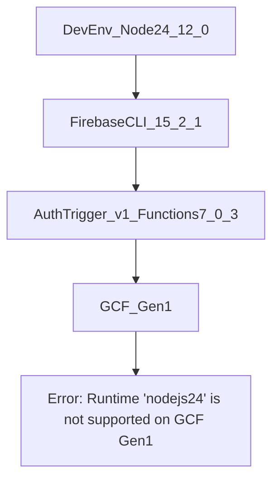

# MRE: Support node 24 on GCF Gen1 (for Authentication function triggers)

Minimal reproducible example for [firebase/firebase-functions#1805](https://github.com/firebase/firebase-functions/issues/1805).

## Context

Authentication triggers are only available on Firebase Functions v1 (GCF Gen1). Using an engine specifier `>=24` (or runtime `nodejs24`) with a 1st-gen Auth trigger causes deploy to fail because GCF Gen1 does not support the Node 24 runtime.

## Environment (from issue)

| Component           | Version    |
|--------------------|------------|
| Node               | v24.12.0   |
| firebase-functions | 7.0.3      |
| firebase-tools     | 15.2.1     |
| firebase-admin     | 13.6.0     |

## Prerequisites

- Node.js **v24.12.0** (e.g. `nvm install 24.12.0 && nvm use 24.12.0`, or use `functions/.nvmrc`).
- Firebase CLI **15.2.1** (install globally or use `npx firebase` from the project after `npm install` in `functions/`).
- A Firebase project with **Functions** and **Authentication** enabled (Blaze plan required for Functions).

## Setup

1. From the MRE root (`firebase/firebase-functions/issue-1805`):

   ```bash
   cd functions
   npm install
   npm run build
   ```

2. Set the active Firebase project (or edit `.firebaserc` in the MRE root):

   ```bash
   firebase use <your-project-id>
   ```

## Steps to reproduce

1. From the MRE root (`firebase/firebase-functions/issue-1805`), run:

   ```bash
   npx firebase deploy --only functions
   ```

   Or from `functions/` after building:

   ```bash
   npm run deploy
   ```

2. Use **firebase-tools@15.2.1** and **Node 24.12.0** when running the deploy.

## Expected behavior

A single Node version (latest active LTS, e.g. Node 24) can be used for the project, and the 1st-gen Authentication trigger deploys successfully to GCF Gen1 with that runtime.

## Actual behavior

Deploy fails with:

```text
Runtime "nodejs24" is not supported on GCF Gen1 for function [function name]
```

Firebase encourages migration to v2 functions (which support Node 24) but does not offer Authentication triggers on v2, and GCF Gen1 does not support the Node 24 runtime, making it impossible to use a single Node 24 codebase for Auth triggers.

## Debug log

After reproducing the failure, a `firebase-debug.log` is written in the MRE root. You can copy it to this directory for triage:

- **Path:** `firebase/firebase-functions/issue-1805/firebase-debug.log`

Capture it with the versions above to aid regression testing and debugging.

## Flow (maintainers)



## Project structure

```text
issue-1805/
├── .firebaserc
├── firebase.json
├── README.md
└── functions/
    ├── .nvmrc
    ├── index.ts
    ├── package.json
    └── tsconfig.json
```
