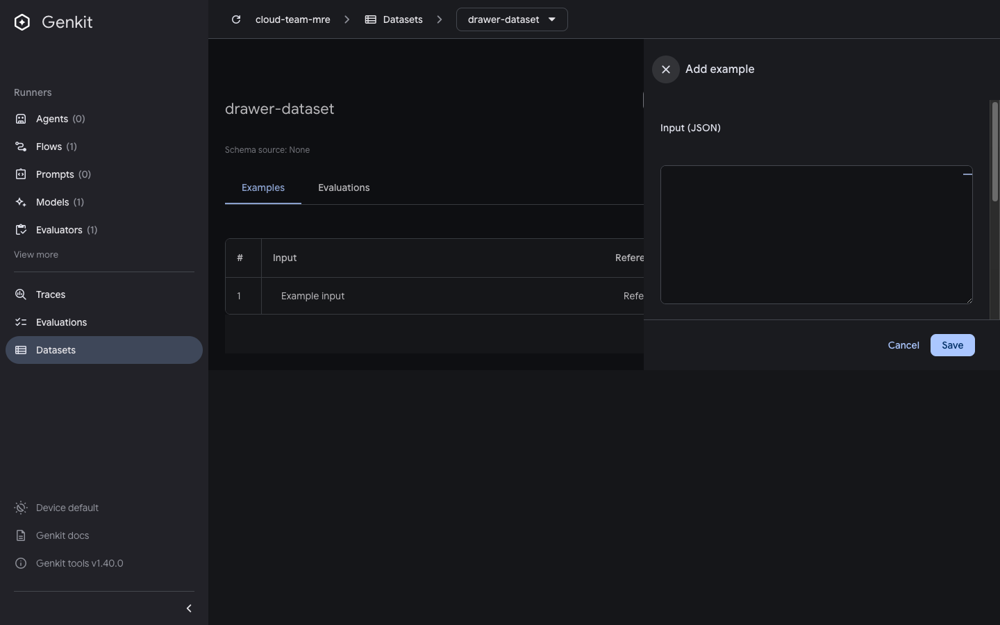

# Datasets drawer header diverges from the shared drawer treatment

Issue: https://github.com/genkit-ai/genkit/issues/4532 (UI/UX item 8)

```bash
pnpm repro datasets-drawer-style
# open http://localhost:4000/datasets/drawer-dataset
```

1. Click **Add example** to open the datasets drawer.
2. Compare its header with other Dev UI drawers (for example the trace side
   panel): those render the title first and the close button last, with an
   accessible label and a standard header height/border/background.

- **Expected:** the datasets drawer follows the same header convention.
- **Actual:** the close button renders before the title, carries no
  `aria-label` (screen readers announce an unlabeled button), and the header
  is missing the shared height/border/surface treatment.




Last verified against: `genkit-cli` 1.40.0
