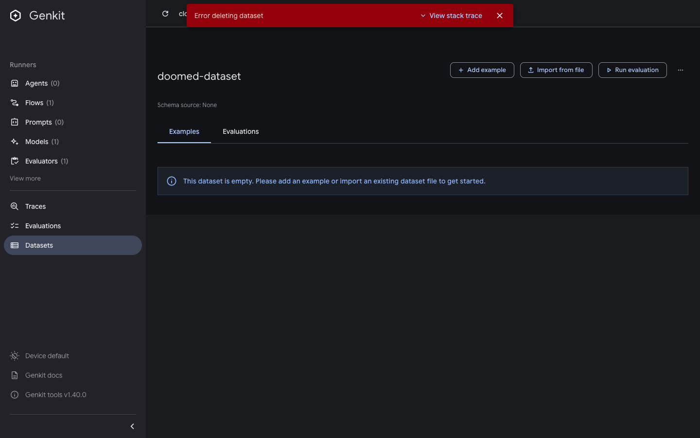

# Delete-dataset dialog closes on error

Issue: https://github.com/genkit-ai/genkit/issues/4415

```bash
pnpm repro delete-dataset-error
# open http://localhost:4000/datasets/doomed-dataset
```

To observe the bug you need the server-side delete to fail. The simplest
induction is making the dataset index read-only before confirming:

```bash
chmod 444 .genkit/datasets/index.json
```

Then in the UI: delete the dataset and click **Confirm** in the dialog.

- **Expected:** on error the dialog stays open and shows what went wrong, so
  you can retry or cancel with context.
- **Actual:** the dialog closes immediately no matter what; the only feedback
  is a context-free "Error deleting dataset" snackbar.

Cleanup afterwards:

```bash
chmod 644 .genkit/datasets/index.json
```




Last verified against: `genkit-cli` 1.40.0
