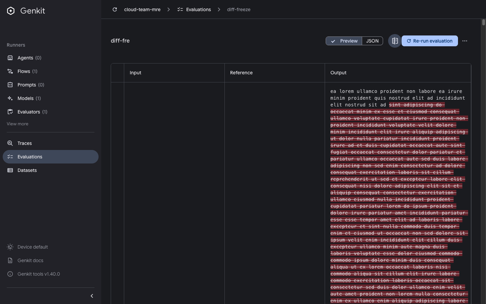

# Eval details diff view freezes on large outputs

Issue: https://github.com/genkit-ai/genkit/issues/4532 (UI/UX item 3)

```bash
pnpm repro diff-view-freeze
# open http://localhost:4000/evaluate/diff-freeze
```

The seeded eval run has one row whose `output` and `reference` are each ~300KB
of text that differ by scattered word edits. Because the row has reference
data, the eval details toolbar shows the "text_compare" diff toggle.

## Steps

1. Open the eval run at the URL above.
2. Click the diff toggle (the `text_compare` icon button in the toolbar, next to
   "Re-run evaluation" - its tooltip reads "Click to see diff between reference
   output and evals output").

- **Expected:** the diff renders within a few hundred milliseconds and the tab
  stays responsive.
- **Actual:** the tab freezes for ~2 seconds - clicks, scrolling and hover do
  nothing - because the output-vs-reference diff is computed synchronously over
  the large strings on the render path.

## Measured freeze vs. output size

Single synchronous block in the toggle's click handler (`performance.now()`
around the click; matches the browser `longtask` durations), Chrome via
`agent-browser`, `genkit-cli` 1.39.0:

| Output / reference size | Main-thread block |
| --- | --- |
| 10 KB | ~60 ms |
| 50 KB | ~420 ms |
| 100 KB | ~1760 ms |
| 300 KB (default) | ~2000 ms |
| 600 KB | ~2010 ms |

The jump from 50 KB to 100 KB is super-linear (size doubles, block ~4x),
consistent with a synchronous diff whose cost grows faster than the input; it
plateaus near ~2 s at larger sizes. The freeze is negligible at the few-KB
outputs of a normal eval and becomes an unmistakable multi-second hang around
100 KB and above.

Override the seeded size to reproduce a specific point:

```bash
DIFF_SIZE_KB=600 pnpm repro diff-view-freeze
```




Last verified against: `genkit-cli` 1.39.0
