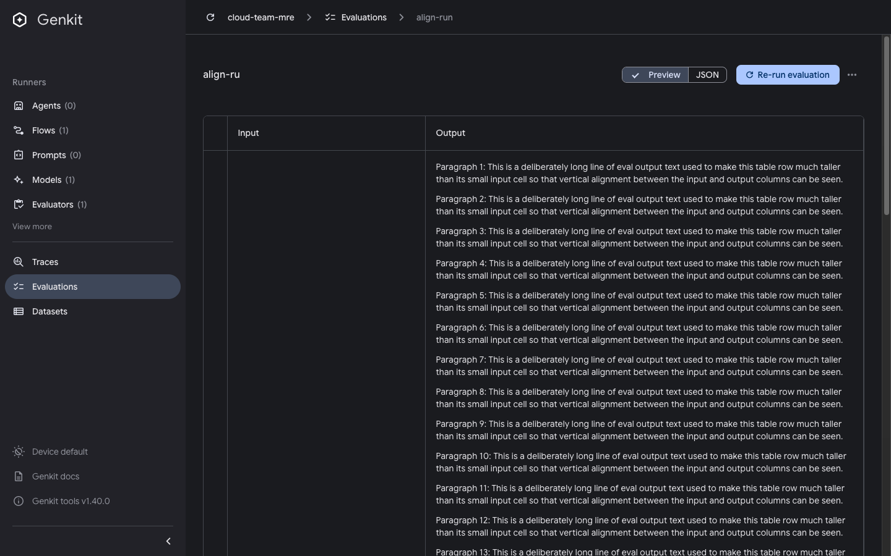

# Eval details cells are not top-aligned

Issue: https://github.com/genkit-ai/genkit/issues/4532 (UI/UX item 1)

```bash
pnpm repro eval-cell-alignment
# open http://localhost:4000/evaluate/align-run
```

The seeded eval run has one row with a one-word input and a 40-paragraph
output.

- **Expected:** input and output content start on the same line, so rows can be
  compared at a glance.
- **Actual:** cell content is vertically centered (the Material table default),
  so the input renders ~1400px below the output's first line and the input
  column appears empty until you scroll.




Last verified against: `genkit-cli` 1.40.0
