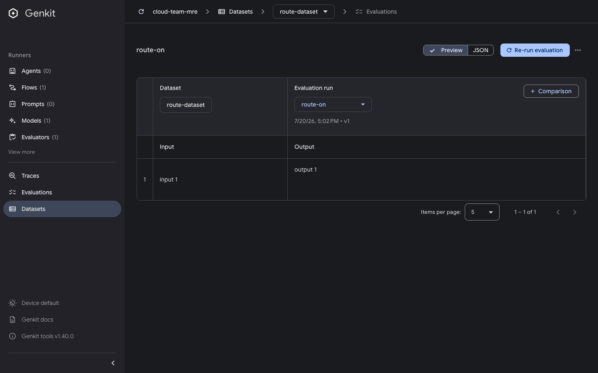

# Clicking an eval run on the Evaluations page routes into the Datasets section

Issue: https://github.com/genkit-ai/genkit/issues/4532 (UI/UX item 6)

```bash
pnpm repro eval-run-routing
# open http://localhost:4000/evaluate
```

Two eval runs are seeded on one dataset. The URL opens the Evaluations list
page, where the left-nav **Evaluations** item is highlighted.

1. Click the **route-one** row in the runs table.

- **Expected:** you stay within the Evaluations section - the left-nav
  highlight stays on **Evaluations** and the URL stays under `/evaluate`.
- **Actual:** the URL becomes `/datasets/route-dataset/evaluate/route-one` and the
  left-nav highlight jumps from **Evaluations** to **Datasets**, which is
  disorienting.




Last verified against: `genkit-cli` 1.40.0
